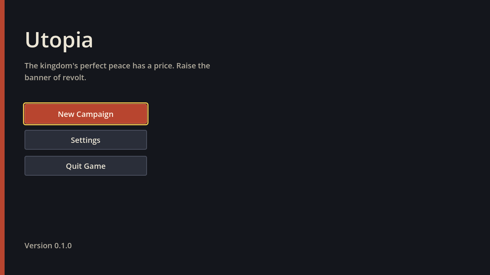
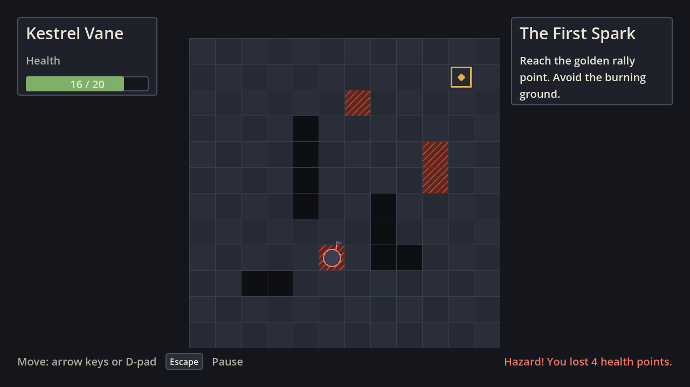
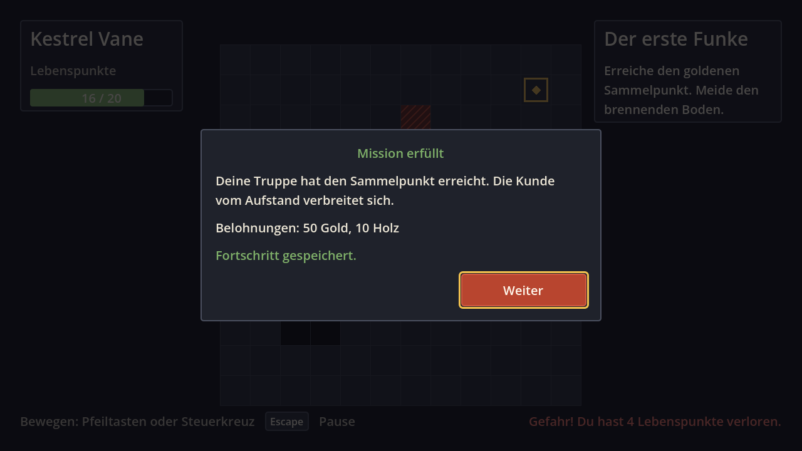
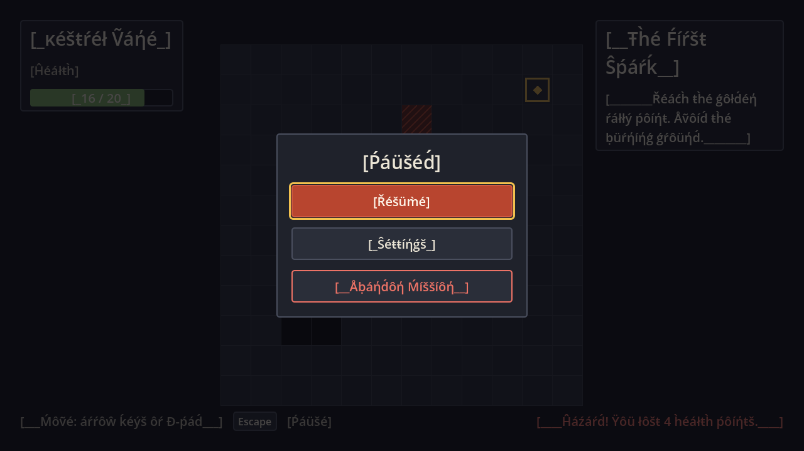
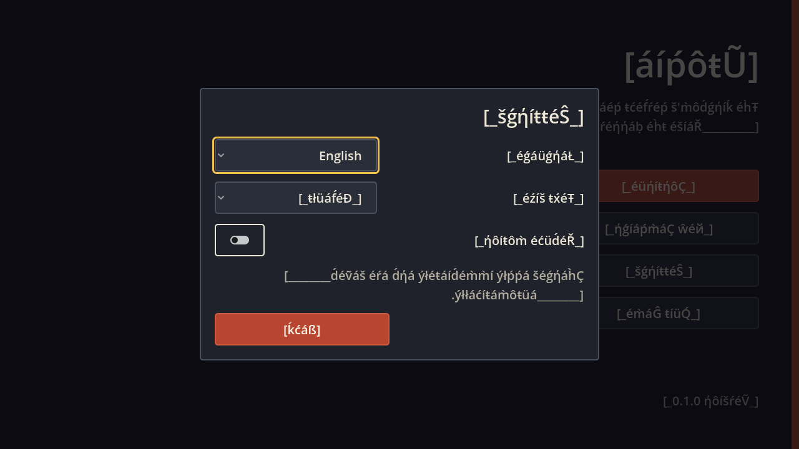

# Utopia

A tactical single-player RPG: a former soldier uncovers a kingdom's dark
secret and builds a revolutionary army. Deck-driven battles on
Fire-Emblem-sized grids, freely combinable hero + battalion units, base
building, scouting, and a soul-energy system that decides between liberation
and tyranny. Design: [`docs/game-design/mechanics-and-core-loop.md`](docs/game-design/mechanics-and-core-loop.md).

**Status: initial architecture.** The project boots, shows a localized main
menu, and plays a minimal mission (move one unit across a 12×12 grid, avoid
hazards, reach the objective, autosave). Card play, enemies, and the base are
not built yet — see "Blueprint coverage" in [`docs/ARCHITECTURE.md`](docs/ARCHITECTURE.md).

| | |
|---|---|
| Engine | Godot 4.6 (≥ 4.5 required), typed GDScript |
| Renderer | GL Compatibility, 2D |
| Platforms | Windows, Linux |
| Languages | English (source), German |



## Getting started

1. Install [Godot 4.6](https://godotengine.org/download) (standard build, not .NET).
2. Open `project.godot` in the editor, or from a terminal:
   ```bash
   godot --path . --import          # first time: build the class cache
   godot --path .                   # run the game
   godot --path . -- --route=gameplay   # debug builds: jump straight into a mission
   ```
3. Controls: arrow keys / D-pad move, Esc / Start pauses, Enter/Space/A
   confirm, Esc/B back.

## Tests

```bash
GODOT=/path/to/godot tests/run_tests.sh                 # everything CI runs
godot --headless --path . res://tests/framework/test_runner.tscn -- --filter=save
```

121 automated tests (unit + integration), boot smoke runs, translation key
extraction, and an optional locale screenshot tool. See [`docs/TESTING.md`](docs/TESTING.md).
CI: `.github/workflows/ci.yml`.

## Project layout

```
addons/ assets/ autoload/ core/ features/ scenes/ networking/ shaders/ tests/ docs/
```

Explained in [`docs/ARCHITECTURE.md`](docs/ARCHITECTURE.md).

## Documentation

| Doc | Topic |
|---|---|
| [ARCHITECTURE](docs/ARCHITECTURE.md) | Layers, autoloads, runtime flow, coverage, limitations |
| [SCENE_TREE_RULES](docs/SCENE_TREE_RULES.md) | Scene ownership, node references, lifetimes |
| [SIGNALS_AND_EVENTS](docs/SIGNALS_AND_EVENTS.md) | Signal contracts and input actions |
| [RESOURCES](docs/RESOURCES.md) | Data Resources and content |
| [SAVE_SYSTEM](docs/SAVE_SYSTEM.md) | Save format, backends, migrations |
| [UI_ARCHITECTURE](docs/UI_ARCHITECTURE.md) | Screens, buttons, theme, accessibility |
| [LOCALIZATION](docs/LOCALIZATION.md) | Keys, catalogs, formatting, adding languages |
| [ANIMATION_AND_MOVEMENT](docs/ANIMATION_AND_MOVEMENT.md) | Movement/animation audit |
| [COLLISION_AND_HIT_DETECTION](docs/COLLISION_AND_HIT_DETECTION.md) | Collision audit |
| [TESTING](docs/TESTING.md) | Test runner and coverage |
| [ADDING_A_FEATURE](docs/ADDING_A_FEATURE.md) | Step-by-step recipe |
| [AI_INSTRUCTIONS](docs/AI_INSTRUCTIONS.md) | Rules for AI assistants and contributors |
| [decisions/](docs/decisions/) | Architecture decision records |

## Screenshots

Captured with `tests/tools/screenshot_capture.tscn` (English, German,
pseudolocalized, right-to-left):

| | |
|---|---|
|  |  |
|  |  |
